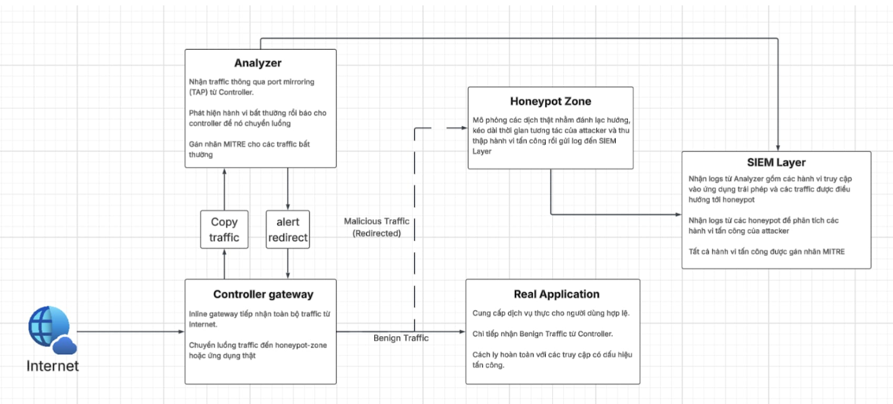
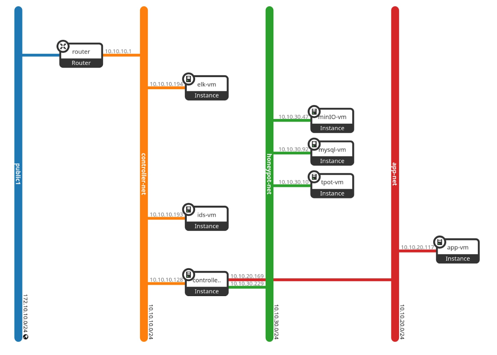

☁️ Cloud Honeypot on OpenStack

       
 
 <b>Cloud-Based Proactive Defense using IDS + Honeypot + SIEM</b>  NT524 – Cloud Computing Architecture & Security   <b>Team 8:</b> Huỳnh Đăng Khoa · Khiếu Bảo Lâm 

📖 Table of Contents

    🌟 Introduction

    🎯 Objectives

    ✨ Key Features

    🏗️ Architecture Overview

    🌐 Network Topology

    🔄 Data Flow

    🧠 Decision Logic

    🧩 Core Components

    🧪 Honeypot Design

    ⚙️ Automatic Redirection

    📊 SIEM & Log Processing

    🎬 Demo Scenarios

    📈 Results

🌟 Introduction

In modern cloud environments, services such as SSH, web applications, object storage (S3), and databases (RDS) are frequent targets of cyberattacks. These services are often exposed due to misconfiguration, weak credentials, or improper access control.

Studies show that publicly exposed cloud resources can be discovered and exploited within minutes using automated scanning tools.

Traditional defensive mechanisms such as firewalls or passive intrusion detection systems are no longer sufficient to handle evolving threats. Instead of only blocking attackers, a more effective approach is to observe and understand their behavior.

This project proposes a proactive defense architecture by combining intrusion detection with a honeypot system. When suspicious activity is detected, the attacker is not blocked immediately but is transparently redirected into a controlled, simulated environment.

This approach allows the system to:

    Protect real services from compromise

    Collect valuable threat intelligence

    Analyze attacker techniques in depth

🎯 Objectives

🔍 Detect attacks in real time using IDS

🔄 Automatically redirect attackers

🧪 Simulate real cloud services (SSH, HTTP, S3, MySQL)

📊 Centralize logs using SIEM

🏷️ Map attacks to MITRE ATT&CK

✨ Key Features

Real-time detection with Suricata IDS

Automatic DNAT redirection

Multi-service honeypot environment

Centralized logging (ELK Stack)

GeoIP-based attacker tracking

MITRE ATT&CK mapping

Fully deployed on OpenStack

🏗️ Architecture Overview

  

🔹 System Layers
        Layer	                  Description
Controller	            Entry point, NAT, redirection
Analyzer	            Traffic inspection & detection
Honeypot Zone	        Fake services
SIEM Layer	            Logging & visualization
🌐 Network Topology

  

🔹 Networks

External Network → Public access

Management Network → Control traffic (SSH)

Honeypot Network → Isolated fake services

Real App Network → Protected real services

🔄 Data Flow
Internet → Controller → Analyzer → Detection → Redirect → Honeypot → ELK
Flow Explanation

Traffic enters Controller

Mirrored to Analyzer

Suricata analyzes

Attack detected

Python script processes alert

Controller updates NAT rules

Attacker redirected

Logs sent to ELK

🧠 Decision Logic
Traffic	Action
Legitimate	Forward to real service
Malicious	Redirect to honeypot
Strategy

Real services → non-standard ports

Honeypots → default ports

👉 Attackers are naturally trapped.

🧩 Core Components
🔹 Suricata IDS

Deep packet inspection

Detects brute-force, scanning, exploitation

🔹 Python Orchestrator

Reads logs in real-time

Extracts attacker IP

Triggers redirection

🔹 Controller

Applies NAT rules

Controls traffic flow

🧪 Honeypot Design
Service	Description
SSH	Fake login + command logging
HTTP	Fake web server
S3 (MinIO)	Fake cloud storage
MySQL	Fake database
⚙️ Automatic Redirection Mechanism
Workflow

Monitor IDS logs

Extract attacker IP

Check existing rules

Apply DNAT rule

Redirect all future traffic

✅ Fully automated
⚡ Near real-time (<2s)

📊 SIEM & Log Processing
Pipeline
Filebeat → Logstash → Elasticsearch → Kibana
Features

Centralized logging

GeoIP enrichment

MITRE mapping

Real-time dashboards

🎬 Demo Scenarios

🔁 Detection → Redirection → Deception → Logging → Visualization

🔐 SSH Brute-force Attack

Attacker runs brute-force tool

Suricata detects abnormal login attempts

Attacker is redirected to SSH honeypot

🎭 Result

Fake login succeeds

Attacker executes commands

All activity is logged

🌐 HTTP Scanning

Attacker scans endpoints (/admin, /login)

Detected as reconnaissance

🎭 Result

Redirected to fake web server

Logs include payload + User-Agent

☁️ S3 Attack (MinIO)

Attacker scans object storage

Attempts to access buckets

🎭 Result

Interacts with fake S3

Upload/download logged

🗄️ MySQL Attack

Attacker connects to port 3306

Attempts login & queries

🎭 Result

Redirected to fake DB

SQL queries captured

🎥 Demo Video

  

📈 Results

⏱️ Redirection latency: < 2 seconds

📊 Processed logs: 50,000+ events

🎯 High detection accuracy

📊 Clear visualization via Kibana